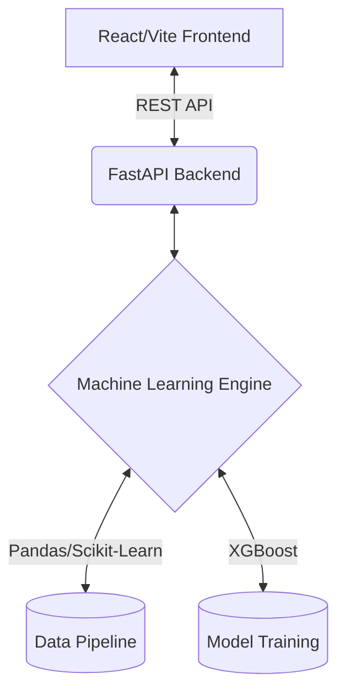

<div align="center">
  
  
  # 🚀 SaleSense: Advanced Sales Predictor
  
  **A world-class machine learning platform for enterprise sales forecasting.**
  
  [](https://reactjs.org/)
  [](https://vitejs.dev/)
  [](https://fastapi.tiangolo.com/)
  [](https://www.python.org/)
  
  <p align="center">
    <a href="#features">✨ Features</a> •
    <a href="#architecture">🏗️ Architecture</a> •
    <a href="#quick-start">🚀 Quick Start</a> •
    <a href="#documentation">📚 Documentation</a>
  </p>
</div>

---

## 🌟 Overview

**SaleSense** is a state-of-the-art predictive analytics platform designed to transform raw sales data into actionable, high-precision forecasts. Leveraging powerful machine learning models (XGBoost, Isolation Forests) and a highly aesthetic, glassmorphism-inspired React dashboard, SaleSense provides an unparalleled user experience and accuracy.

## ✨ Key Features

- **🔮 Advanced Predictive Modeling**: Utilizes advanced time-series forecasting, lag features, and multi-level groupings to predict sales with high accuracy.
- **🛡️ Robust Outlier Detection**: Implements IQR, Z-score, and Isolation Forest techniques to ensure data integrity.
- **🎨 Premium UI/UX**: A visually stunning frontend built with React and Vite, featuring dark mode, glassmorphism, dynamic micro-animations, and modern typography.
- **⚡ Blazing Fast API**: Powered by FastAPI, ensuring lightning-fast data retrieval and model inference.
- **📊 Interactive Analytics Dashboard**: Real-time visualization of sales trends, model performance, and key metrics.

---

## 🏗️ Architecture

The project has been upgraded to a full-stack architecture for maximum scalability:



### 📁 Directory Structure
- `/frontend`: Modern React application (Vite, Lucide React).
- `/backend`: Python API and Machine Learning models (`Datathon.py`, `xg.py`).
- `/data`: Datasets for training and evaluation.

---

## 🚀 Quick Start

### 1. Start the Backend

Navigate to the `backend` directory, install requirements, and run the FastAPI server:

```bash
cd backend
pip install -r requirements.txt
uvicorn main:app --reload
```
The API will be available at `http://localhost:8000`.

### 2. Start the Frontend

Navigate to the `frontend` directory, install dependencies, and start the Vite development server:

```bash
cd frontend
npm install
npm run dev
```
The beautiful UI dashboard will be running at `http://localhost:5173`.

---

## 🤝 Contributing

Contributions, issues, and feature requests are welcome! 
We strive to keep SaleSense a **world-class product**, so please adhere to our strict UI/UX guidelines when modifying the frontend.

## 📄 License

This project is licensed under the MIT License.

---
<div align="center">
  <p>Built with ❤️ by Senaaravichandran</p>
</div>
